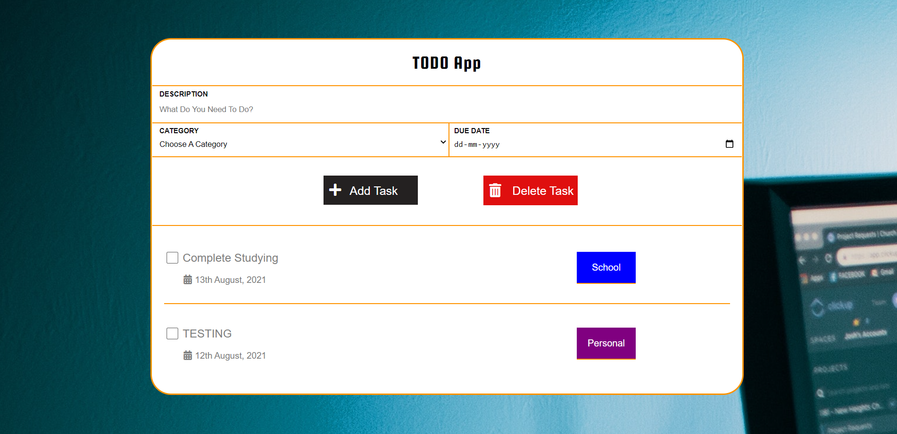

# ToDoList

➼ ToDo List Using NodeJS & ExpressJS.

➼ Used MongoDB as the database to store the tasks.

➼ npm install the necessary modules.

➼ I developed this during my bootcamp tenure at Coding Ninjas.
 
➼ Preview Image:

